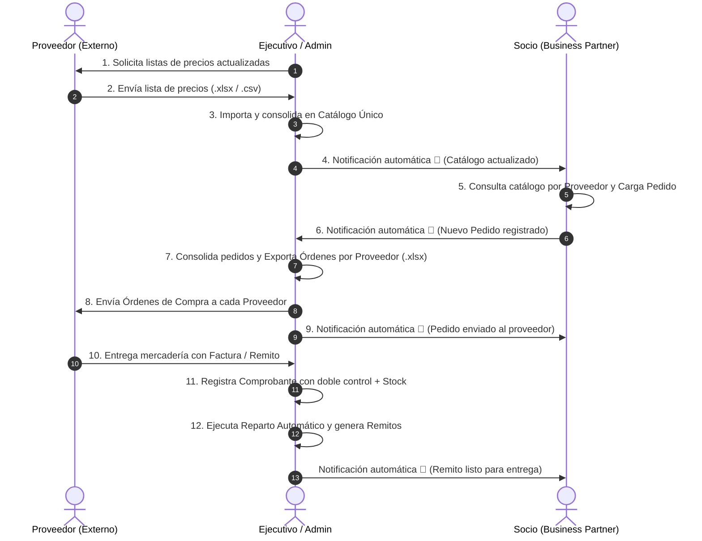

# Manual de Usuario - Rosario Compras

Sistema de compras agrupadas, consolidación automática de demanda y gestión logística con doble control.

---

## 1. Introducción y Objetivo del Sistema

**Rosario Compras** centraliza y automatiza la relación comercial entre los comercios adheridos (**Socios**) y los grandes distribuidores (**Proveedores**), coordinada por el **Ejecutivo de Cuentas**.

- **Carga Digital de Pedidos:** Los socios cargan sus propios pedidos desde el catálogo segmentado por proveedor.
- **Consolidación Automática:** El sistema suma y totaliza la demanda de todos los socios con 0% error humano.
- **Exportación de Órdenes:** Genera planillas de Excel listas para cada proveedor (`.xlsx`).
- **Recepción con Doble Control:** Controla precios facturados (Compras) y cantidades físicas recibidas (Logística).
- **Reparto Inteligente:** Prorratea automáticamente en caso de entregas parciales y emite remitos con notificaciones.

---

## 2. Roles y Credenciales de Acceso

| Rol | Nombre / Comercio | Email | Contraseña | Permisos |
| :--- | :--- | :--- | :--- | :--- |
| `admin` | Administrador General | `admin@rosariocompras.com` | `admin123` | Acceso total y auditoría. |
| `ejecutivo` | Ejecutivo de Cuentas | `ejecutivo@rosariocompras.com` | `account123` | Importación de listas, consolidación, órdenes a proveedores, comprobantes y reparto. |
| `socio` | Café Central (Socio 1) | `socio1@rosariocompras.com` | `socio123` | Carga de pedidos por proveedor, avisos y remitos. |
| `socio` | Panadería La Rosa (Socio 2) | `socio2@rosariocompras.com` | `socio123` | Carga de pedidos por proveedor, avisos y remitos. |
| `socio` | Restaurante Italia (Socio 3) | `socio3@rosariocompras.com` | `socio123` | Carga de pedidos por proveedor, avisos y remitos. |

---

## 3. Diagrama del Circuito Operativo (11 Pasos)

---

## 4. Guía para el Socio (Business Partner)

1. **Iniciar Sesión:** Ingresa con tu email y contraseña asignados.
2. **Consultar Productos por Proveedor:** En la pantalla verás las listas separadas por cada distribuidor (ej. Distribuidora Central, Lácteos del Litoral, Insumos Gastronómicos).
3. **Cargar Cantidades:** Ingresa las cantidades en la columna *Cantidad a Pedir*. El sistema calcula automáticamente los subtotales y el Total General en tiempo real.
4. **Confirmar Pedido:** Presiona el botón azul **"🛒 Confirmar y Enviar Pedido Consolidado del Socio"**. Tu pedido quedará registrado en estado *Pendiente* y el Ejecutivo recibirá un aviso automático.
5. **Avisos y Remitos:** Recibirás notificaciones en la campana `🔔` cuando tu pedido sea enviado a los proveedores y cuando esté disponible el Remito de entrega.

---

## 5. Guía para el Ejecutivo de Cuentas

### Módulo 1: Listas de Proveedores
- Selecciona el proveedor y presiona **"📧 Solicitar Lista al Proveedor"** si deseas registrar la solicitud formal.
- Presiona **"Seleccionar Planilla (.xlsx / .csv)"** para cargar la lista recibida y revisa la vista previa.
- Presiona **"📥 Procesar e Importar al Catálogo Único"** para actualizar precios y notificar a todos los socios.

### Módulo 3: Consolidación y Envío a Proveedores
- Revisa la tabla donde se suma automáticamente toda la demanda pendiente de los socios.
- Presiona el botón verde **"Órdenes por Proveedor (.xlsx)"** para exportar las órdenes de compra listas para enviar a cada proveedor.
- Presiona **"📤 Enviar a Proveedores y Consolidar"** para confirmar el despacho y notificar a los socios.

### Módulo 4: Recepción y Reparto Automático
- Cuando llegue el camión o la entrega del proveedor, ingresa el número de Factura / Remito.
- Realiza el **Doble Control**:
  - *Logística:* Cantidad Recibida física vs Cantidad Solicitada.
  - *Compras:* Precio Facturado vs Precio Acordado.
- Presiona **"💾 1. Asentar Comprobante y Registrar Stock Físico"**.
- Presiona **"🚚 2. Ejecutar Reparto Automático y Generar Remitos"** para emitir los remitos a cada socio (con prorrateo automático si hubo faltantes).

---

## 6. Preguntas Frecuentes (FAQ)

- **¿Qué pasa si el proveedor entrega menos mercadería?** El sistema aplica automáticamente la regla de prorrateo proporcional equitativo entre todos los socios que demandaron ese artículo.
- **¿Cómo abrir el manual interactivo?** Haz doble clic en el archivo `MANUAL_DE_USUARIO.html` o ejecuta `start MANUAL_DE_USUARIO.html` en la terminal.
