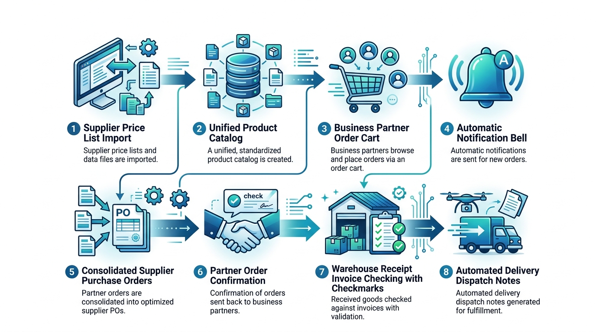
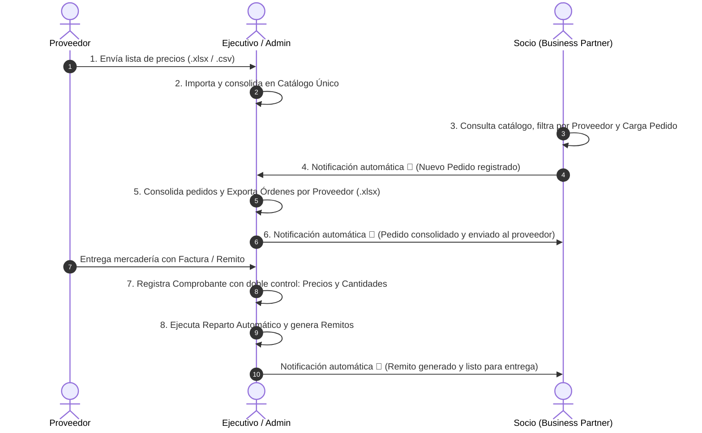

# Rosario Compras - Walkthrough del Circuito Operativo (8 Pasos)

Documento explicativo del flujo integral de abastecimiento, compras agrupadas, comprobantes de proveedor con doble control, reparto automático y sistema de notificaciones.

---

## 1. Infografía Visual del Circuito



---

## 2. Diagrama de Secuencia



---

## 3. Descripción de los 8 Pasos Operativos

### Paso 1: Recepción de Listas de Precios
El proveedor envía su planilla de artículos y listas de precios en formato Excel (`.xlsx`) o `.csv`.

### Paso 2: Importación y Catálogo Único
El ejecutivo de cuentas selecciona el proveedor en el módulo **"1. Listas de Proveedores"**, previsualiza la planilla y la incorpora masivamente al catálogo unificado (`ARTICULOS` y `PRECIOS_NEGOCIADOS`).

### Paso 3: Carga Digital de Pedido por Socio
El socio ingresa al módulo **"Cargar Pedido"**, visualiza los artículos disponibles, puede filtrar por proveedor específico y carga cantidades en el carrito (el cual se preserva de forma inteligente entre filtros).

### Paso 4: Notificación Automática al Ejecutivo
Al confirmar el pedido, el sistema genera automáticamente una notificación dirigida al Ejecutivo de Cuentas:
> *"El socio [Nombre] registró el Pedido #X ([N] productos)."*

### Paso 5: Consolidación y Exportación por Proveedor
El ejecutivo accede al módulo **"Consolidar y Enviar a Proveedores"**, evalúa la demanda agrupada de todos los socios y genera órdenes de compra en archivos de Excel independientes por proveedor (ej. `Orden_Compra_DistribuidoraCentral.xlsx`).

### Paso 6: Notificación de Envío al Proveedor
Al confirmar la consolidación, cada socio involucrado recibe una notificación automática en su panel:
> *"Tu Pedido #X fue consolidado y enviado al proveedor para su preparación."*

### Paso 7: Recepción de Comprobante con Doble Control
Al llegar el pedido físico del proveedor, el ejecutivo registra el comprobante en el módulo **"Recepción y Reparto Automático"**:
- **Cabecera:** Proveedor, Tipo de Comprobante (Factura / Remito), Nro. de Comprobante.
- **Control de Compras:** Compara *Precio Facturado* vs *Precio Acordado en Catálogo*.
- **Control de Logística:** Compara *Cantidad Físicamente Recibida* vs *Cantidad Solicitada*.
- **Actualización de Stock:** Guarda el comprobante en `COMPROBANTES_PROVEEDOR` y actualiza el stock real en el depósito.

### Paso 8: Reparto Automático, Prorrateo y Remitos
El ejecutivo presiona **"Ejecutar Reparto Automático"**:
- Si la cantidad física recibida fue menor a la demandada, el sistema calcula el prorrateo proporcional equitativo.
- Actualiza los pedidos a estado `'Procesado'`.
- Genera los `REMITOS` oficiales de entrega y sus renglones.
- Dispara una notificación a cada socio:
  > *"¡Tu Remito #Y (Pedido #X) fue generado! La mercadería está lista para su retiro/envío."*

---

## 4. Resultados de las Pruebas de Integración (8/8 OK)

```text
=== INICIANDO PRUEBAS DEL CIRCUITO COMPLETO ===
[OK] Test 1: Autenticación correcta para Admin, Ejecutivo y Socios.
[OK] Test 2: Importación de lista de proveedor y consolidación en catálogo único.
[OK] Test 3: Socio 1 registró Pedido #4 eligiendo productos por proveedor.
[OK] Test 4: Notificación automática generada para el Ejecutivo de Cuentas.
[OK] Test 5: Exportación de Órdenes de Compra segmentadas por Proveedor (.xlsx).
[OK] Test 6: 4 pedidos consolidados y notificación enviada al Socio ('enviado al proveedor').
[OK] Test 7: Comprobante de proveedor #1 registrado con doble control y stock actualizado.
[OK] Test 8: Reparto automático ejecutado, remitos generados con prorrateo y notificaciones emitidas.

=== ¡CIRCUITO COMPLETO DE 8 PASOS VERIFICADO CON ÉXITO (8/8 PRUEBAS OK)! ===
```

---

## 5. Credenciales de Acceso

| Rol | Nombre | Email | Contraseña |
| :--- | :--- | :--- | :--- |
| `admin` | Administrador General | `admin@rosariocompras.com` | `admin123` |
| `ejecutivo` | Ejecutivo de Cuentas | `ejecutivo@rosariocompras.com` | `account123` |
| `socio` | Café Central (Socio 1) | `socio1@rosariocompras.com` | `socio123` |
| `socio` | Panadería La Rosa (Socio 2) | `socio2@rosariocompras.com` | `socio123` |
