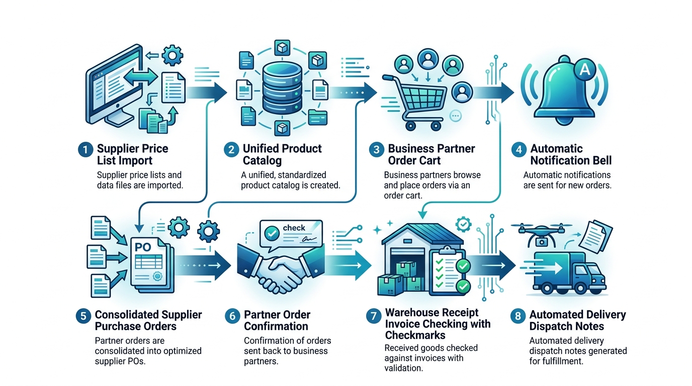
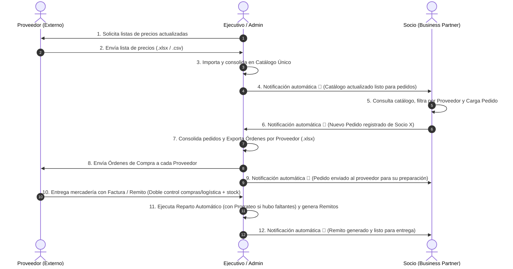

# Rosario Compras - Walkthrough del Circuito Operativo (11 Pasos)

Documento explicativo del flujo integral de abastecimiento, compras agrupadas, comprobantes de proveedor con doble control, reparto automático y sistema de notificaciones.

---

## 1. Infografía Visual del Circuito



---

## 2. Diagrama de Secuencia


```mermaid
sequenceDiagram
    autonumber
    actor Prov as Proveedor (Externo)
    actor Ejec as Ejecutivo / Admin
    actor Socio as Socio (Business Partner)

    Ejec->>Prov: 1. Solicita listas de precios actualizadas
    Prov->>Ejec: 2. Envía lista de precios (.xlsx / .csv)
    Ejec->>Ejec: 3. Importa y consolida en Catálogo Único
    Ejec->>Socio: 4. Notificación automática 🔔 (Catálogo actualizado listo para pedidos)
    Socio->>Socio: 5. Consulta catálogo, filtra por Proveedor y Carga Pedido
    Socio->>Ejec: 6. Notificación automática 🔔 (Nuevo Pedido registrado de Socio X)
    Ejec->>Ejec: 7. Consolida pedidos y Exporta Órdenes por Proveedor (.xlsx)
    Ejec->>Prov: 8. Envía Órdenes de Compra a cada Proveedor
    Ejec->>Socio: 9. Notificación automática 🔔 (Pedido enviado al proveedor para su preparación)
    Prov->>Ejec: 10. Entrega mercadería con Factura / Remito (Doble control compras/logística + stock)
    Ejec->>Ejec: 11. Ejecuta Reparto Automático (con Prorrateo si hubo faltantes) y genera Remitos
    Ejec->>Socio: 12. Notificación automática 🔔 (Remito generado y listo para entrega)
```

---

## 3. Descripción de los Pasos Operativos

### Paso 1: Solicitud de Listas de Precios
El Ejecutivo de Cuentas inicia el ciclo solicitando formalmente las listas de precios actualizadas a los proveedores asignados desde el módulo **"1. Listas de Proveedores"**.

### Paso 2: Recepción de Listas de Precios
El proveedor (externo al sistema) envía su planilla de artículos y precios en formato Excel (`.xlsx`) o `.csv`.

### Paso 3: Importación y Catálogo Único
El ejecutivo selecciona el proveedor, previsualiza la planilla y la incorpora masivamente al catálogo unificado (`ARTICULOS` y `PRECIOS_NEGOCIADOS`).

### Paso 4: Aviso Masivo de Catálogo Disponible
🔔 El sistema emite automáticamente una notificación a todos los Socios:
> *"El Ejecutivo actualizó el catálogo único con productos de [Proveedor]. Ya puedes consultar precios y cargar tu pedido."*

### Paso 5: Carga Digital de Pedido por Socio
El socio ingresa al módulo **"Cargar Pedido"**, visualiza los artículos disponibles, filtra por proveedor específico y carga cantidades en el carrito persistente.

### Paso 6: Notificación Automática al Ejecutivo
🔔 Al confirmar el pedido, el sistema genera automáticamente una notificación dirigida al Ejecutivo de Cuentas:
> *"El socio [Nombre] registró el Pedido #X ([N] productos)."*

### Paso 7: Consolidación y Exportación por Proveedor
El ejecutivo accede al módulo **"Consolidar y Enviar a Proveedores"**, evalúa la demanda agrupada y genera órdenes de compra en archivos de Excel independientes por proveedor (ej. `Orden_Compra_DistribuidoraCentral.xlsx`).

### Paso 8 y 9: Envío de Órdenes a Proveedores y Notificación al Socio
El ejecutivo confirma el envío de las órdenes a los proveedores. Los pedidos pasan a estado `'Consolidado'` y cada socio involucrado recibe una notificación:
> *"Tu Pedido #X fue consolidado y enviado al proveedor para su preparación."*

### Paso 10: Recepción de Comprobante con Doble Control
Al llegar el pedido físico del proveedor, el ejecutivo registra el comprobante en el módulo **"Recepción y Reparto Automático"**:
- **Cabecera:** Proveedor, Tipo de Comprobante (Factura / Remito), Nro. de Comprobante.
- **Control de Compras:** Compara *Precio Facturado* vs *Precio Acordado en Catálogo*.
- **Control de Logística:** Compara *Cantidad Físicamente Recibida* vs *Cantidad Solicitada*.
- **Actualización de Stock:** Guarda el comprobante en `COMPROBANTES_PROVEEDOR` y actualiza el stock real en el depósito.

### Paso 11 y 12: Reparto Automático, Prorrateo y Remitos
El ejecutivo presiona **"Ejecutar Reparto Automático"**:
- Si la cantidad física recibida fue menor a la demandada, el sistema calcula el prorrateo proporcional equitativo.
- Actualiza los pedidos a estado `'Procesado'`.
- Genera los `REMITOS` oficiales de entrega y sus renglones.
- 🔔 Dispara una notificación a cada socio:
  > *"¡Tu Remito #Y (Pedido #X) fue generado! La mercadería está lista para su retiro/envío."*

---

## 4. Resultados de las Pruebas de Integración (8/8 OK)

```text
=== INICIANDO PRUEBAS DEL CIRCUITO OPERATIVO REFINADO ===
[OK] Test 1: Autenticación correcta para Admin, Ejecutivo y Socios.
[OK] Test 2: Solicitud de lista de precios a proveedor registrada exitosamente.
[OK] Test 3: Lista importada al catálogo único y notificación masiva enviada a todos los socios.
[OK] Test 4: Socio 1 registró Pedido #5 y Ejecutivo recibió notificación automática.
[OK] Test 5: Órdenes de Compra por Proveedor exportadas a planillas Excel independientes.
[OK] Test 6: Órdenes enviadas a proveedores y notificación emitida a los socios ('enviado al proveedor').
[OK] Test 7: Comprobante #2 registrado con doble control de compras/logística y stock actualizado.
[OK] Test 8: Reparto automático ejecutado con prorrateo equitativo y remitos notificados a socios.

=== ¡CIRCUITO REFINADO COMPLETO VERIFICADO CON ÉXITO (8/8 PRUEBAS OK)! ===
```

---

## 5. Credenciales de Acceso

| Rol | Nombre | Email | Contraseña |
| :--- | :--- | :--- | :--- |
| `admin` | Administrador General | `admin@rosariocompras.com` | `admin123` |
| `ejecutivo` | Ejecutivo de Cuentas | `ejecutivo@rosariocompras.com` | `account123` |
| `socio` | Café Central (Socio 1) | `socio1@rosariocompras.com` | `socio123` |
| `socio` | Panadería La Rosa (Socio 2) | `socio2@rosariocompras.com` | `socio123` |
