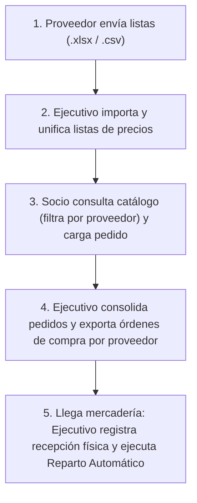

# Plan de Implementación: Adaptación del Circuito Completo de Negocio (Rosario Compras)

Este plan alinea la arquitectura del sistema al circuito operativo real de 5 pasos documentado en [circuito.md](file:///c:/Users/Eros%20David/OneDrive/Documentos/projects/rosario-compras-sistema/circuito.md).

---

## Circuito de Negocio Objetivo

---

## Propuesta de Cambios por Módulo

### 1. Módulo de Listas de Precios de Proveedores (Pasos 1 y 2)

Permite al Ejecutivo de Cuentas / Administrador subir las planillas de los proveedores para mantener actualizado el catálogo único de artículos y precios.

#### [NEW] [catalogo_view.py](file:///c:/Users/Eros%20David/OneDrive/Documentos/projects/rosario-compras-sistema/src/views/catalogo_view.py) y [catalogo.ui](file:///c:/Users/Eros%20David/OneDrive/Documentos/projects/rosario-compras-sistema/src/views/catalogo.ui)
- Selector de Proveedor (`QComboBox`) al que pertenece la lista.
- Selector de Archivo (`.xlsx`, `.xls`, `.csv`) con previsualización de datos leídos vía `pandas`.
- Botón *"Procesar e Importar al Catálogo"* que inserta o actualiza los artículos en `ARTICULOS` y sus precios en `PRECIOS_NEGOCIADOS`.

#### [NEW] [catalogo_model.py](file:///c:/Users/Eros%20David/OneDrive/Documentos/projects/rosario-compras-sistema/src/models/catalogo_model.py) y [catalogo_controller.py](file:///c:/Users/Eros%20David/OneDrive/Documentos/projects/rosario-compras-sistema/src/controllers/catalogo_controller.py)
- Métodos para leer archivos con `pandas`, validar estructura y guardar masivamente en SQLite.
- Método para listar proveedores disponibles en la base de datos.

---

### 2. Módulo de Carga de Pedido del Socio (Paso 3)

Permite al Socio elegir productos filtrando por proveedor y visualizando claramente el origen de cada artículo.

#### [MODIFY] [carga_pedido.ui](file:///c:/Users/Eros%20David/OneDrive/Documentos/projects/rosario-compras-sistema/src/views/carga_pedido.ui)
- Agregar selector desplegable `cmb_proveedor` (*"Todos los proveedores"*, *"Distribuidora Central"*, etc.).
- Agregar columna *"Proveedor"* en la tabla de catálogo.

#### [MODIFY] [pedido_view.py](file:///c:/Users/Eros%20David/OneDrive/Documentos/projects/rosario-compras-sistema/src/views/pedido_view.py) y [pedido_controller.py](file:///c:/Users/Eros%20David/OneDrive/Documentos/projects/rosario-compras-sistema/src/controllers/pedido_controller.py)
- Mantener en memoria el carrito de compras del socio para que no se pierdan cantidades cargadas al alternar entre filtros de proveedores.
- Poblar dinámicamente el combo de proveedores desde la base de datos.

---

### 3. Módulo de Consolidación y Pedidos a Proveedor (Paso 4)

Permite al Ejecutivo consolidar la demanda de los socios y exportar las órdenes de compra listas para enviar a cada proveedor.

#### [MODIFY] [consolidacion_model.py](file:///c:/Users/Eros%20David/OneDrive/Documentos/projects/rosario-compras-sistema/src/models/consolidacion_model.py)
- Agregar método `exportar_ordenes_por_proveedor(carpeta_destino)`: genera un archivo de Excel independiente por cada proveedor que tenga artículos demandados (ej. `Orden_DistribuidoraCentral.xlsx`, `Orden_LacteosLitoral.xlsx`) con las cantidades totales acumuladas.
- Mantener la exportación de la planilla consolidada general multi-hoja.

#### [MODIFY] [consolidacion_view.py](file:///c:/Users/Eros%20David/OneDrive/Documentos/projects/rosario-compras-sistema/src/views/consolidacion_view.py) y [consolidacion.ui](file:///c:/Users/Eros%20David/OneDrive/Documentos/projects/rosario-compras-sistema/src/views/consolidacion.ui)
- Agregar botón *"Exportar Órdenes por Proveedor"* (permite seleccionar una carpeta destino y exporta automáticamente los archivos por proveedor).

---

### 4. Módulo de Recepción y Reparto Automático (Paso 5)

Permite registrar la cantidad física real entregada por el proveedor antes de disparar el reparto y prorrateo hacia los socios.

#### [MODIFY] [reparto_automatico.ui](file:///c:/Users/Eros%20David/OneDrive/Documentos/projects/rosario-compras-sistema/src/views/reparto_automatico.ui) y [reparto_view.py](file:///c:/Users/Eros%20David/OneDrive/Documentos/projects/rosario-compras-sistema/src/views/reparto_view.py)
- Agregar tabla/sección de **"Recepción de Mercadería"** donde el ejecutivo visualiza lo solicitado por los socios y puede cargar/confirmar la cantidad real que ingresó al depósito.
- Botón *"Registrar Ingreso y Procesar Reparto"*.

#### [MODIFY] [reparto_model.py](file:///c:/Users/Eros%20David/OneDrive/Documentos/projects/rosario-compras-sistema/src/models/reparto_model.py)
- Método para actualizar stock con la mercadería recibida y ejecutar el cálculo de prorrateo equitativo y generación de remitos.

---

### 5. Integración y Menú de Navegación por Rol

#### [MODIFY] [main.py](file:///c:/Users/Eros%20David/OneDrive/Documentos/projects/rosario-compras-sistema/main.py)
- Configurar el menú según el nuevo esquema:
  - **`socio`**:
    - `Cargar Pedido`
  - **`ejecutivo`** y **`admin`**:
    - `1. Importar Listas de Proveedores`
    - `2. Cargar Pedido`
    - `3. Consolidar y Enviar a Proveedores`
    - `4. Recepción y Reparto Automático`

---

## Plan de Verificación

### 1. Verificación Automatizada
- Test de importación de planilla de prueba de proveedor (.xlsx) y verificación en BD (`ARTICULOS` y `PRECIOS_NEGOCIADOS`).
- Test de pedido de socio con filtro de proveedor.
- Test de exportación de órdenes segmentadas por proveedor.
- Test de ingreso de mercadería física parcial y prorrateo en generación de remitos.

### 2. Verificación Manual en la Interfaz
1. **Login como Ejecutivo:** Subir una planilla de prueba de un proveedor y constatar que se actualizan los precios.
2. **Login como Socio:** Filtrar por dicho proveedor, agregar cantidades y confirmar el pedido.
3. **Login como Ejecutivo:**
   - Consolidar los pedidos y exportar las órdenes de compra individuales por proveedor.
   - Registrar la llegada de mercadería (con cantidades menores a las pedidas para forzar prorrateo).
   - Confirmar el reparto y revisar los remitos generados.
