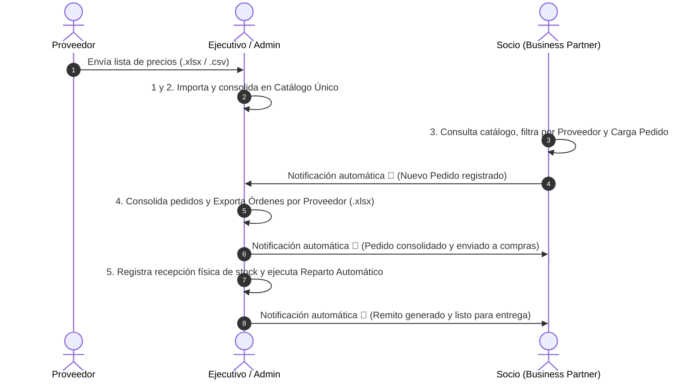

# Walkthrough: Circuito Completo de Negocio y Sistema de Notificaciones

Se ha implementado y verificado con éxito la totalidad del flujo operativo definido en [circuito.md](file:///c:/Users/Eros%20David/OneDrive/Documentos/projects/rosario-compras-sistema/circuito.md) junto con el sistema de notificaciones automáticas entre Socios y Ejecutivos.

---

## El Circuito Implementado (5 Pasos + Notificaciones)



---

## Resumen de Módulos y Cambios

### 1. Base de Datos y Notificaciones
- **[0004_add_notifications.sql](file:///c:/Users/Eros%20David/OneDrive/Documentos/projects/rosario-compras-sistema/migrations/0004_add_notifications.sql):** Tabla `NOTIFICACIONES` con tipos `nuevo_pedido`, `pedido_consolidado` y `reparto`.
- **[notificacion_model.py](file:///c:/Users/Eros%20David/OneDrive/Documentos/projects/rosario-compras-sistema/src/models/notificacion_model.py) y [notificaciones_dialog.py](file:///c:/Users/Eros%20David/OneDrive/Documentos/projects/rosario-compras-sistema/src/views/notificaciones_dialog.py):** Centro de notificaciones con diálogo modal y contador de pendientes en la barra superior.

### 2. Pasos 1 y 2: Catálogo y Listas de Proveedores
- **[catalogo_model.py](file:///c:/Users/Eros%20David/OneDrive/Documentos/projects/rosario-compras-sistema/src/models/catalogo_model.py):** Lectura e importación masiva de planillas `.xlsx`/`.csv` hacia `ARTICULOS` y `PRECIOS_NEGOCIADOS`.
- **[catalogo_view.py](file:///c:/Users/Eros%20David/OneDrive/Documentos/projects/rosario-compras-sistema/src/views/catalogo_view.py) y [catalogo.ui](file:///c:/Users/Eros%20David/OneDrive/Documentos/projects/rosario-compras-sistema/src/views/catalogo.ui):** Pantalla para que el Ejecutivo seleccione el proveedor, previsualice la planilla y la incorpore al catálogo.
- **[catalogo_controller.py](file:///c:/Users/Eros%20David/OneDrive/Documentos/projects/rosario-compras-sistema/src/controllers/catalogo_controller.py):** Orquestación del módulo.

### 3. Paso 3: Carga de Pedidos por Socio con Filtro por Proveedor
- **[carga_pedido.ui](file:///c:/Users/Eros%20David/OneDrive/Documentos/projects/rosario-compras-sistema/src/views/carga_pedido.ui) y [pedido_view.py](file:///c:/Users/Eros%20David/OneDrive/Documentos/projects/rosario-compras-sistema/src/views/pedido_view.py):** Selector `QComboBox` de proveedor y columna en la tabla. El carrito en memoria preserva las cantidades seleccionadas al alternar filtros.
- **[pedido_model.py](file:///c:/Users/Eros%20David/OneDrive/Documentos/projects/rosario-compras-sistema/src/models/pedido_model.py):** Emite notificación automática al Ejecutivo al confirmar un pedido.

### 4. Paso 4: Consolidación y Exportación por Proveedor
- **[consolidacion_model.py](file:///c:/Users/Eros%20David/OneDrive/Documentos/projects/rosario-compras-sistema/src/models/consolidacion_model.py):** Genera órdenes de compra en archivos `.xlsx` independientes por cada proveedor (`Orden_Compra_DistribuidoraCentral.xlsx`, etc.).
- **[consolidacion_view.py](file:///c:/Users/Eros%20David/OneDrive/Documentos/projects/rosario-compras-sistema/src/views/consolidacion_view.py) y [consolidacion.ui](file:///c:/Users/Eros%20David/OneDrive/Documentos/projects/rosario-compras-sistema/src/views/consolidacion.ui):** Botón para exportación directa a carpeta. Emite notificaciones a cada socio al consolidar.

### 5. Paso 5: Recepción de Mercadería y Reparto Automático
- **[reparto_automatico.ui](file:///c:/Users/Eros%20David/OneDrive/Documentos/projects/rosario-compras-sistema/src/views/reparto_automatico.ui) y [reparto_view.py](file:///c:/Users/Eros%20David/OneDrive/Documentos/projects/rosario-compras-sistema/src/views/reparto_view.py):** Grilla interactiva para registrar el stock físico real ingresado del camión/proveedor.
- **[reparto_model.py](file:///c:/Users/Eros%20David/OneDrive/Documentos/projects/rosario-compras-sistema/src/models/reparto_model.py):** Compara demanda vs stock real, aplica prorrateo equitativo si hay faltantes, asienta remitos y notifica a los socios.

### 6. Menú y Navegación en [main.py](file:///c:/Users/Eros%20David/OneDrive/Documentos/projects/rosario-compras-sistema/main.py)
- **Socio:** Acceso enfocado a `🛍️ Cargar Pedido` y su campana de notificaciones.
- **Ejecutivo / Admin:** Acceso completo al circuito de 4 pantallas modulares + notificaciones.

---

## Resultados de Pruebas Automatizadas

Se ejecutó la suite de pruebas de integración con 8 validaciones de extremo a extremo:

```text
=== INICIANDO PRUEBAS DEL CIRCUITO COMPLETO ===
[OK] Test 1: Autenticacion correcta para Admin, Ejecutivo y Socios.
[OK] Test 2: Importacion de lista de proveedor y consolidacion en catalogo unico.
[OK] Test 3: Socio 1 registro Pedido #4 eligiendo productos por proveedor.
[OK] Test 4: Notificacion automatica generada para el Ejecutivo de Cuentas.
[OK] Test 5: Exportacion de Ordenes de Compra segmentadas por Proveedor (.xlsx).
[OK] Test 6: 4 pedidos consolidados y notificacion enviada al Socio 1.
[OK] Test 7: Recepcion de stock fisico y ejecucion de reparto automatico con remitos.
[OK] Test 8: Notificacion de entrega de remito generada para el Socio.

=== ¡CIRCUITO COMPLETO VERIFICADO EXITOSAMENTE (8/8 PRUEBAS OK)! ===
```
