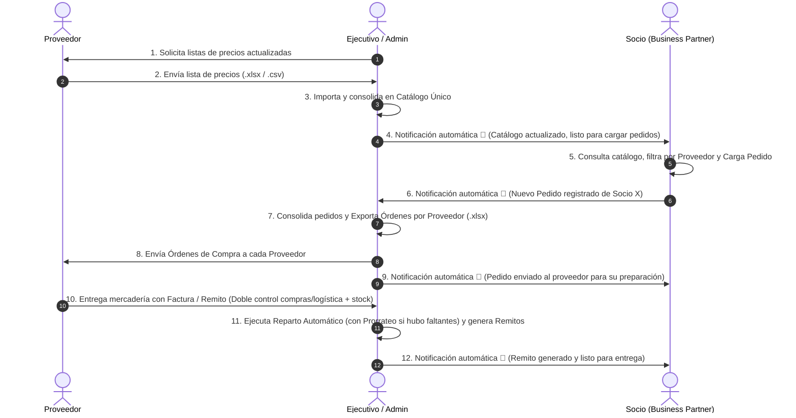

# Plan de Implementación: Incorporación de Nuevos Pasos Operativos y Notificaciones

Este plan detalla los cambios a nivel global en el sistema (base de datos, modelos, vistas, controladores, notificaciones y documentación) para incorporar los pasos operativos identificados.

---

## 🔄 El Circuito Completo Refinado (11 Pasos)

---

## 🛠️ Propuesta de Cambios por Módulo

### 1. Módulo de Catálogo y Listas de Proveedores (Pasos 1, 2, 3 y 4)

#### [MODIFY] [catalogo.ui](file:///c:/Users/Eros%20David/OneDrive/Documentos/projects/rosario-compras-sistema/src/views/catalogo.ui) y [catalogo_view.py](file:///c:/Users/Eros%20David/OneDrive/Documentos/projects/rosario-compras-sistema/src/views/catalogo_view.py)
- **Botón de Solicitud (Paso 1):** Agregar botón *"📧 Solicitar Lista de Precios al Proveedor"* que permite registrar/emitir la solicitud formal de cotización/lista al proveedor seleccionado.
- **Acción de Notificación al Importar (Paso 4):** Checkbox o confirmación automática: *"Notificar a todos los socios sobre la actualización del catálogo"*.

#### [MODIFY] [catalogo_model.py](file:///c:/Users/Eros%20David/OneDrive/Documentos/projects/rosario-compras-sistema/src/models/catalogo_model.py) y [catalogo_controller.py](file:///c:/Users/Eros%20David/OneDrive/Documentos/projects/rosario-compras-sistema/src/controllers/catalogo_controller.py)
- Método `solicitar_lista_proveedor(id_proveedor)`: Registra la fecha y emisión de la solicitud de lista de precios al proveedor.
- Al finalizar `importar_lista_proveedor()`:
  - Recupera todos los usuarios con rol `'socio'`: `SELECT id FROM USERS WHERE role = 'socio'`.
  - Emite una notificación a cada socio:
    `"El Ejecutivo actualizó el catálogo único con productos y precios de [Proveedor]. Ya puedes consultar y cargar tu pedido."` (tipo `'catalogo_actualizado'`).

---

### 2. Módulo de Consolidación y Envío a Proveedores (Pasos 7, 8 y 9)

#### [MODIFY] [consolidacion.ui](file:///c:/Users/Eros%20David/OneDrive/Documentos/projects/rosario-compras-sistema/src/views/consolidacion.ui) y [consolidacion_view.py](file:///c:/Users/Eros%20David/OneDrive/Documentos/projects/rosario-compras-sistema/src/views/consolidacion_view.py)
- Separar claramente las acciones en la botonera:
  - *"1. Exportar Planilla General (.xlsx)"*
  - *"2. Exportar Órdenes por Proveedor (.xlsx)"*
  - *"3. Confirmar Consolidación y Despacho a Proveedores"*

#### [MODIFY] [consolidacion_model.py](file:///c:/Users/Eros%20David/OneDrive/Documentos/projects/rosario-compras-sistema/src/models/consolidacion_model.py) y [consolidacion_controller.py](file:///c:/Users/Eros%20David/OneDrive/Documentos/projects/rosario-compras-sistema/src/controllers/consolidacion_controller.py)
- Método `enviar_ordenes_y_consolidar()`:
  - Cambia los pedidos de `'Pendiente'` a `'Consolidado'`.
  - Emite la notificación a cada socio:
    `"Tu Pedido #[id] fue consolidado y enviado al proveedor para su preparación."`

---

### 3. Centro de Notificaciones y Modelos

#### [MODIFY] [notificacion_model.py](file:///c:/Users/Eros%20David/OneDrive/Documentos/projects/rosario-compras-sistema/src/models/notificacion_model.py) y [notificaciones_dialog.py](file:///c:/Users/Eros%20David/OneDrive/Documentos/projects/rosario-compras-sistema/src/views/notificaciones_dialog.py)
- Soporte para el nuevo tipo `catalogo_actualizado` con icono distintivo (ej. 📑 / 🏷️).
- Método `notificar_a_todos_los_socios(mensaje, tipo)` para facilitar avisos globales del catálogo.

---

### 4. Documentación y Diagramas

#### [MODIFY] [WALKTHROUGH.html](file:///c:/Users/Eros%20David/OneDrive/Documentos/projects/rosario-compras-sistema/WALKTHROUGH.html), [WALKTHROUGH.md](file:///c:/Users/Eros%20David/OneDrive/Documentos/projects/rosario-compras-sistema/WALKTHROUGH.md), [circuito.md](file:///c:/Users/Eros%20David/OneDrive/Documentos/projects/rosario-compras-sistema/circuito.md) y [README.md](file:///c:/Users/Eros%20David/OneDrive/Documentos/projects/rosario-compras-sistema/README.md)
- Actualizar el diagrama Mermaid con los 11 pasos y las etiquetas exactas.
- Actualizar la descripción de cada paso en las tarjetas del HTML y el Markdown.

---

## 🧪 Plan de Verificación

### 1. Verificación Automatizada (`scratch/test_suite.py`)
- Test 1: Solicitud de lista de precios a proveedor.
- Test 2: Importación de catálogo y verificación de notificaciones emitidas a **todos los socios** (`catalogo_actualizado`).
- Test 3: Carga de pedido por socio y notificación al ejecutivo.
- Test 4: Exportación de órdenes por proveedor y confirmación de envío a proveedores.
- Test 5: Notificación a cada socio informando que su pedido fue enviado al proveedor.
- Test 6: Registro de factura/remito del proveedor con doble control compras/logística.
- Test 7: Reparto automático, remitos y notificación de entrega.

### 2. Verificación Manual en la Interfaz Gráfica
1. Iniciar sesión como **Ejecutivo**:
   - Ir a "1. Listas de Proveedores" y probar el botón de solicitar lista.
   - Importar una planilla de proveedor.
2. Iniciar sesión como **Socio 1**:
   - Abrir `🔔 Notificaciones` y constatar el aviso de nuevo catálogo disponible.
   - Cargar un pedido.
3. Iniciar sesión como **Ejecutivo**:
   - Verificar notificación del nuevo pedido.
   - Consolidar y despachar órdenes a proveedores.
4. Iniciar sesión como **Socio 1**:
   - Verificar notificación de que su pedido fue enviado al proveedor.
5. Iniciar sesión como **Ejecutivo**:
   - Cargar comprobante de recepción y ejecutar reparto.
   - Verificar remito generado en el panel del socio.
